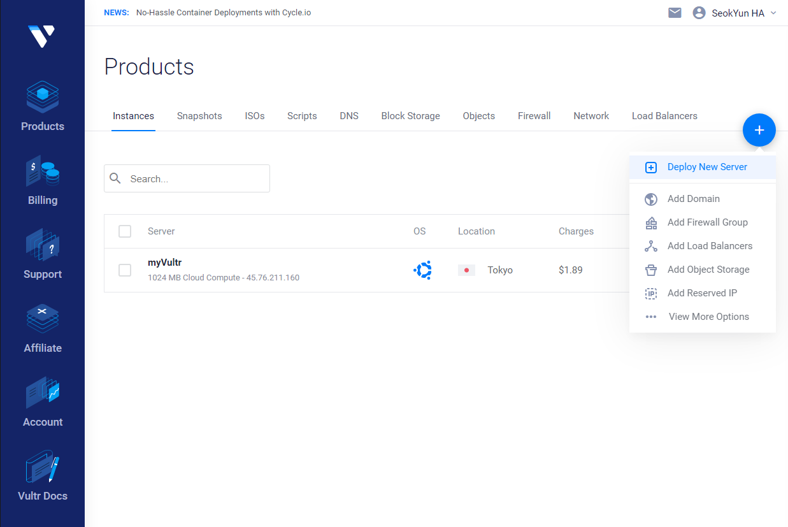
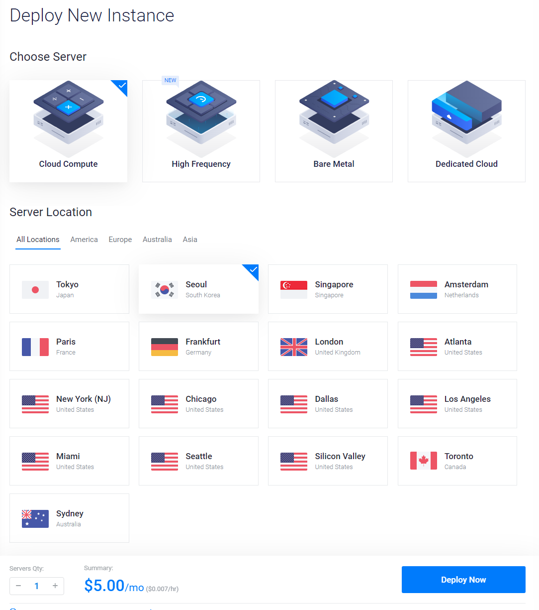
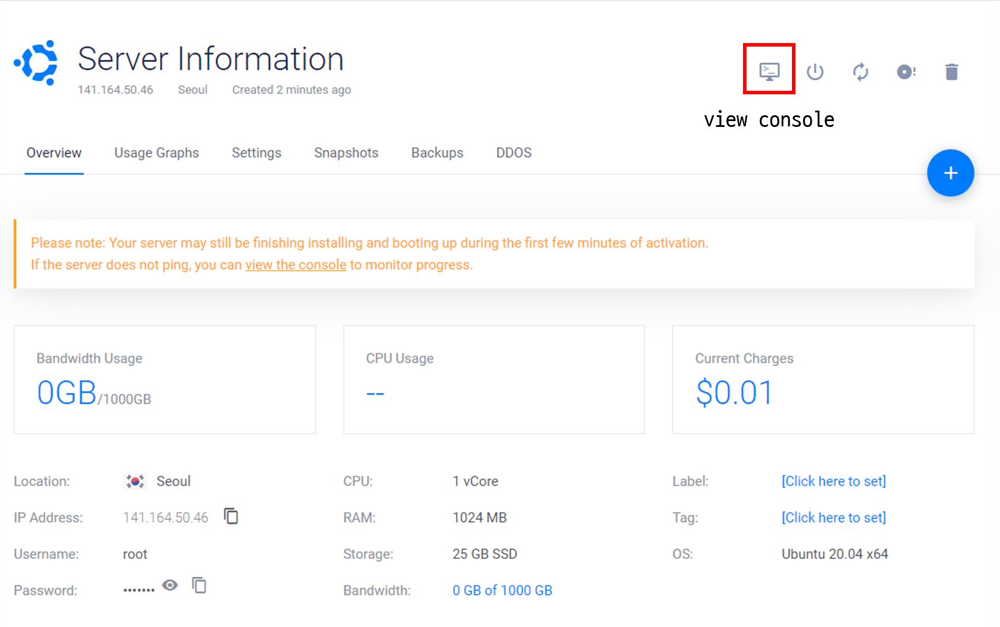
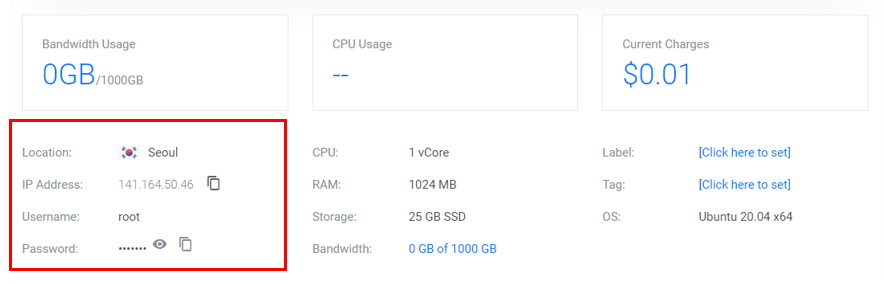
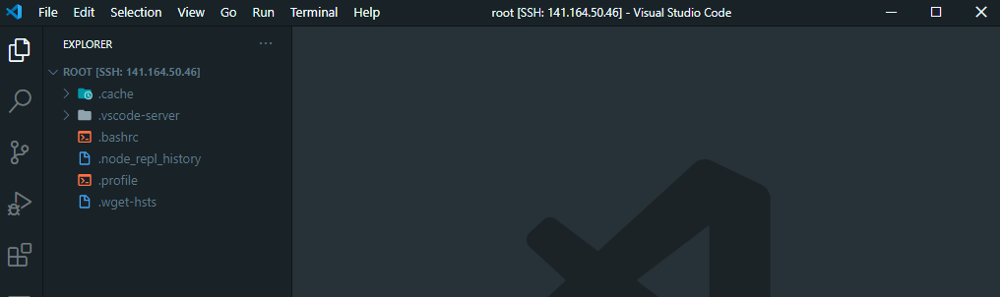

수업 영상 링크: [link](https://drive.google.com/file/d/1Yh5XtcLhMsAeYlKhFHwsmrTY3PDtHroY/view?usp=sharing) <br>


#### 키워드
- 호스팅(hosting)
- [Vultr](https://www.vultr.com/) 서버로 호스팅하기

<hr>

### 도입말

우리는 지금까지 **<u>로컬 환경</u>**에서 `NodeJS` 서버를 실행해 사용했습니다. 물론 실제 서비스를 로컬 환경에서 제공하는 경우도 종종 있지만, 로컬 컴퓨터를 계속 켜둬야 한다는 단점이 있습니다. 24시간 내내 전기를 공급해줘야 하고, 인터넷 역시 끊어짐이 없어야 합니다. 로컬 컴퓨터가 바이러스가 감염된다면, 보안 문제도 발생할 수 있고요.

그래서 실제 서비스를 게시할 때는 로컬 환경이 아니라 항상 켜져있는 서버 컴퓨터를 하나 빌려 서비스를 게시합니다! 이렇게 서버를 빌려서 서비스 하는 것을 **<u>호스팅(Hosting)</u>**이라고 합니다. 

[AWS(Amazon Web Serivce)](https://aws.amazon.com/ko/)와 [Vultr](https://www.vultr.com/)를 통해 호스팅 서비스를 이용할 수 있습니다! 백엔드 세미나에서는 Vultr를 통해 여러분이 제작한 CRUD 서버를 외부 컴퓨터에서 호스팅 하는 방식을 알아봅시다!! [^1] [^2]

<hr>

<div style="text-align: center;">
  
</div>

※ 주의: 이번 세미나 과정에서 vultr의 서버 하나를 빌리게 됩니다. 한 달에 $5 정도의 비용인데, 한 달 전부를 사용하지 않고도 중간에 언제든지 중지할 수 있습니다!! :)

### Vultr 호스팅

Vultr 서비스에서 서버를 호스팅 하는 방식을 살펴봅시다!

#### 회원가입

먼저 [Vultr](https://www.vultr.com/)에 회원가입 합니다.

<div style="text-align: center;">
  
</div>

#### Billing 정보 등록

Vultr는 2가지 형태의 결제 방식을 제공합니다.

1. 결제 수단 등록 후, 사용한 만큼 청구
2. 사용량을 충전해, 사용한 만큼 차감

둘 중 어느 방식을 사용해도 무관합니다!

#### 인스턴스(Instance) 생성




로그인 후에 `Products` 탭으로 이동합니다.

이후 (+) 버튼을 클릭하고, `Deploy New Server`를 클릭합니다.

<br>



- `Server Location`은 `Seoul`로 선택
- `Server Type`은 `Ubuntu 20.04 x64`로 선택
- 그 외 나머지는 모두 건들이지 않고, `Deploy Now` 버튼 클릭

이제 **3분** 가량 기다리면, 여러분의 서버 인스턴스를 얻게 됩니다!!

<hr>

#### 콘솔창에 접속해 로그인



`View Console`로 인스턴스의 콘솔창을 열어줍니다.

처음 콘솔을 열게 되면, Vultr 인스턴스에 로그인을 해야 합니다.



위에 기재된 로그인 정보를 이용하시면 됩니다.

``` bash
vultr login: root   
Password:           ## 타이핑해도 문자가 나타나지 않습니다.
```

비밀번호를 입력할 때는 입력한 것이 화면에 표시되지 않으니 신중히 로그인 하시길 바랍니다!! 참고로 복사-붙여넣기를 지원하지 않으니 직접 손으로 타이핑 해야 합니다!

<br>

#### 서버 실행을 위해 초기 설정

우리가 만든 `Express` 서버를 작동시키기 위해 `NodeJS` 등 몇가지를 설치해야 합니다.

아래의 명령어를 통해 `NodeJS`를 설치합시다.

```
apt install nodejs
```

설치가 잘 되었는지, `node`를 실행해봅니다.

<br>

이제 간단한 서버를 실행해야 하는데, 현재 우리의 Vultr 인스턴스에는 실행할 파일이 존재하지 않습니다 ㅠㅠ

복사-붙여넣기도 안 되기 때문에, Vultr에서 제공하는 기본 콘솔이 아닌 다른 방법으로 Vultr 인스턴스에 접속하려고 합니다!

#### VS Code로 Vultr 인스턴스 접속


VS Code의 Extension 탭에서 `Remote - SSH` Extension을 설치합니다.

<br>

설치 후에 VS Code에서 `F1`키를 누른 후에 `Remote-SSH: Connect to Host...`를 실행합니다.

그러면 `SSH`로 접속할 호스트(Host)를 입력하라는 창이 실행됩니다. 여기에 여러분이 만든 Vultr 인스턴스의 `IP Address`와 함께 다음과 같이 입력해줍니다.


그러면, 새로운 VS Code 창이 뜨면서, 몇가지 창이 등장합니다.

각각 `Linux`와 `Save fingerprint`를 선택해줍니다.

그러면 비밀번호를 입력하는 창이 나오는데, 우리 Vultr 인스턴스의 비밀번호를 여기에 입력해주면 됩니다. 복-붙이 가능하니 직접 입력할 필요는 없습니다 ㅎㅎ

<br>

이제 왼편의 `Open Folder` 버튼을 클릭합니다. 그러면, Vultr 인스턴스에서 어떤 폴더를 열기 선택하게 되는데, 우리는 `/root/`를 그대로 열도록 합시다!

다시 또 비밀번호를 입력하라는 창이 나오는데, 또 복-붙해서 입력해줍니다. [^3]

<br>



그러면 위와 같은 화면과 함께 VS Code를 통해 Vultr 인스턴스에 원격접속하게 된 것입니다!! >.< 여기서 작업한 것들이 모두 Vultr 인스턴스에도 그대로 반영됩니다 ㅎㅎ

이제 `myServer`라는 폴더를 만들어 그곳에 우리가 실행할 서버 파일을 옮겨줍시다!

서버는 [Seminar6](https://bluehorn07.github.io/poapper-backend/2020/11/21/BackEnd-Seminar6.html)에서 만든 [Express 전공책 CRUD 서버](https://github.com/BlueHorn07/poapper-backend/blob/master/assets/example/book_express.js)를 실행해보겠습니다.

원래 우리가 VS Code에서 작업하던 것처럼 서버 파일을 작성해 `node`로 실행해주시면 됩니다!

그.런.데. 우리가 `NodeJS`만 설치했지 아직 `express`나 `mysql` 같은 다른 라이브러리는 설치한 상황이 아닙니다!! 그래서 `node`로 실행하면 오류가 날 것입니다 ㅎㅎ

아래의 명령어로 우리가 사용할 라이브러리들을 설치해줍시다.

``` bash
apt install npm # npm 설치 (2분)
npm install express
```

이전과는 다르게 `package-lock.json`과 `node-modules`라는 폴더가 생성될 겁니다. 지금은 중요한 내용이 아니니 일단은 넘어갑시다!

<br>

`mysql`도 설치해줍시다.

``` bash
apt-get update  # 우분투 apt 업데이트
apt install mysql-server # mysql 설치 (2분)
```

설치 후에 `mysql`이 잘 설치되었는지 확인하고, 비밀번호를 설정하기 위해 아래의 명령어로 `mysql`을 실행합니다.

``` bash
mysql -u root -p
> #비밀번호
```

이때, 우분투 mysql의 오류 때문인지, 비밀번호가 잘 등록되지 않는 현상이 발생합니다. `mysql` 접속 후 아래의 명령어를 이용해 비밀번호를 강제로 설정합니다.

```
ALTER USER 'root'@'localhost' IDENTIFIED WITH mysql_native_password BY '사용할 비밀번호';
```

`mysql` 접속에 성공했으면, `SHOW DATABASE;` 명령어로 `mysql`을 확인해줍니다.

우리가 세미나에서 `poapper_backend` Database를 사용하기로 했으므로 `CREATE DATABASE poappser_backend;`로 Database를 생성합니다.

이제 테이블을 생성합니다. 우리가 세미나6에서 `book`이라는 테이블을 아래와 같이 디자인해 사용했습니다. 아래 명령어로 테이블을 생성합니다.

```
CREATE TABLE books(
 id INT(11) NOT NULL AUTO_INCREMENT,
 title VARCHAR(100) NOT NULL,
 author VARCHAR(100) NOT NULL,
 created DATETIME NOT NULL,
 PRIMARY KEY(id)
);
```

이제 다시 `node`로 서버 파일을 실행하면, 이번에는 `mysql` 모듈을 설치하라는 문구가 등장합니다. 아래 명령어로 `NodeJS`의 `mysql`을 설치해줍니다.

```bash
npm install mysql
```

이제 정말로 `node`로 서버 파일을 실행하면...

``` 
Server is listening on 8080 port...
```

라는 문구와 함께 서버가 실행되는 걸 볼 수 있습니다!!!


#### 서버 접속

이제 우리가 열어둔 서버에 접속해봅시다!!

여러분의 Vultr 인스턴스가 가진 `IP Address`에서 설정한 포트를 url로 서버에 접속할 수 있습니다.

``` 
[your vulr instance ip address]:port
(ex) 123.456.0.1:8080
```

축하합니다! 드디어 여러분의 서버를 로컬 컴퓨터가 아닌 외부에서 호스팅할 수 있게 되었습니다!!

(잘 동작하는지 API Tester를 통해 꼭 확인해봅시다!! ^^;)

<hr>

[^1]: AWS를 통해 호스팅하는 방법이 궁금하시다면, 생활코딩 egoing의 강좌를 추천드립니다! [링크](https://opentutorials.org/course/2717)

[^2]: 참고로 저는 AWS보다는 Vultr를 추천드립니다! 호스팅 받은 서버에 접속하기도 더 편리하고, 가격 또한 Vultr가 AWS의 것보다 더 저렴합니다 :)

[^3]: 이렇게 매 접속마다 비밀번호를 입력하는게 귀찮으시면, Vultr 인스턴스에 여러분의 `SSH public key`를 등록해서 접속하는 방법도 있습니다! ㅎㅎ